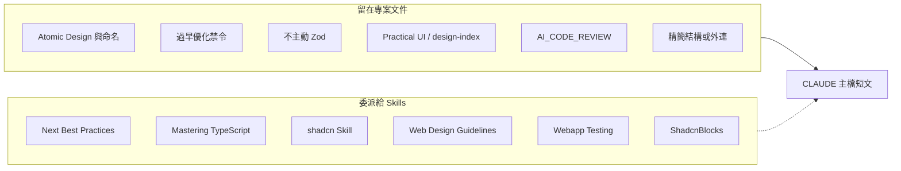

# CLAUDE 文件簡化與已安裝 Skills 對照

> **目的**：6 個 Claude Code Skills 已於 2026-05-05 完成安裝。本文件記錄「依已安裝 Skills 可如何簡化 [CLAUDE_backup.md](../CLAUDE_backup.md)」與「是否適合再加裝新 Skill」的分析結論，以及尚待執行的後續步驟（見第 4 節）。  
> **相關文件**：[claude-skills.md](./claude-skills.md)、[installed-skills.md](./installed-skills.md)、[claude-skills-conflicts.md](./claude-skills-conflicts.md)、[AI_CODE_REVIEW.md](./AI_CODE_REVIEW.md)

---

## 1. 依已安裝 Skills 能否簡化文件（含「專案結構」區塊）？

**結論：可以大幅簡化全文大部分章節；「專案結構」不宜整段刪除，宜精簡或外連。**

### 1.1 適合委派給 Skills（可縮編、改為短引用）

| 主題 | 對應已安裝 Skill（見 [installed-skills.md](./installed-skills.md)） | 建議 |
|------|-------------------------------------------------------------------|------|
| App Router、RSC、metadata、route handlers、hydration、bundling 等 | Next.js Best Practices（laguagu） | 正文改為一句指向 Skill，僅保留**專案覆寫**（例如：嚴禁過早優化） |
| TypeScript 進階模式、`any`、`@ts-ignore` 等 | Mastering TypeScript | 長篇範例可刪減；保留專案底線與「**不主動引入 Zod**」政策 |
| shadcn、`components.json`、OKLCH、dark mode（class strategy） | shadcn/ui Skill（官方） | 元件與 registry 細節委派 |
| WCAG、ARIA、語意 HTML | Web Design Guidelines | 長段 a11y 可縮為「**a11y 優先於視覺極簡**」+ 引用 Skill |
| Playwright 本地互動測試 | Webapp Testing | 流程細節可縮短 |
| 區塊靈感／範本查詢 | ShadcnBlocks | 保留「僅作參考；落地須符合 Atomic Design」 |

### 1.2 必須留在專案文件（Skills 無法取代）

- **Atomic Design 目錄**（`atoms` / `molecules` / `organisms`、`index.tsx` 匯出、`@/app/...` 路徑慣例）。
- **檔名 camelCase**、`[ComponentName]Props` 等專案合約。
- **性能哲學**：與坊間「性能 Skill」常見建議相反時，須寫明「嚴禁過早優化」與例外條件（或使用 [AI_CODE_REVIEW.md](./AI_CODE_REVIEW.md) 為細節來源）。
- **Practical UI / design-index**、與 **AI_CODE_REVIEW** 的對照要求。
- [claude-skills-conflicts.md](./claude-skills-conflicts.md) 所述：**Composition Patterns** 類 Skill 若啟用，需在規則中寫死「Compound 僅限小範圍；目錄仍 Atomic」。

### 1.3 「專案結構」大綱（約 CLAUDE_backup 目錄樹區塊）

Skills **不會**描述本 repo 的 `src/app/components/...`、功能模組路由（`product/`、`order/` 等）。因此：

- **不建議**只保留 `apps/frontend/` → `src/` → `app/` 三行而無下文物件放置說明。
- **建議擇一**：
  - **精簡樹**：只列頂層資料夾角色（`components`、`hooks`、`lib`、`types`、`fonts`、各 feature、`layout.tsx` / `page.tsx`、`public`、`docs`），細部子目錄以「以倉庫現況為準」帶過；或
  - **外連**：完整樹另存 `docs/project-structure.md`，主規範檔只保留 10～25 行摘要 + 連結。

---

## 2. 能否再安裝新 Skills、在不衝突下繼續簡化？

> 以下以 [installed-skills.md](./installed-skills.md) 確認的 6 個已安裝 Skills 為基準，評估是否值得再加裝其他 Skills 來進一步縮短文件。

**結論：可補強的選項很少；主要簡化來自「現有六個 Skill + 刪除重複教學」，而非再堆疊 Skill。**

依 [claude-skills-conflicts.md](./claude-skills-conflicts.md)：

| 選項 | 風險 | 說明 |
|------|------|------|
| **Frontend Design**（anthropics） | 低（規則 friction） | 需在覆寫規則註明「**Web Design Guidelines / a11y 優先於純視覺簡化**」。不取代 Practical UI、Atomic 目錄。 |
| **React Composition Patterns** | 中 | 可加，但須明確覆寫「Compound 僅限 atoms/molecules 內部；目錄仍 Atomic；檔名 camelCase」。 |
| **React Best Practices**（vercel） | 高 | 與專案「避免過早優化」衝突，不建議。 |
| **Tailwind v4 + shadcn**（secondsky） | 高 | 與官方 shadcn Skill 在色彩／dark mode 策略上易衝突，不建議與官方並用。 |
| **Next.js SEO**（laguagu）與既有 Next Best Practices | 中 | 重複觸發，擇一即可。 |
| **Playwright Skill** | 中 | 與 Webapp Testing 用途重疊，維持二擇一。 |

---

## 3. 建議的目標結構（心智模型）

專案中的 **CLAUDE.md / CLAUDE_backup** 理想上變成短文，結構可視為（**注意：此為目標狀態；CLAUDE_backup.md 的實際簡化尚未執行，進度見第 4 節**）：

1. **技術棧一行** + **已安裝 Skills 清單**（連結 [installed-skills.md](./installed-skills.md)）。
2. **Skill 覆寫規則**（過早優化、Zod、shadcn 單一來源、a11y 優先、Atomic + camelCase、測試統一 Webapp Testing）。
3. **僅專案專有**：精簡目錄結構或 `@docs/project-structure.md`、Practical UI / design-index、Code Review 引用。
4. 其餘泛用教學改為「見對應 Skill」或「見 AI_CODE_REVIEW 第 X 章」。

---

## 4. 可選後續（實作檢查清單）

- [x] 決定並完成 Skills 安裝（6 個最小衝突組合，詳見 [installed-skills.md](./installed-skills.md)）。
- [ ] 標註 CLAUDE_backup 各段：對應哪個 Skill vs 專案專屬。
- [ ] 決定專案結構呈現方式：精簡樹 vs `docs/project-structure.md`。
- [ ] 將 Next / TS / shadcn / a11y / 測試長範例改為短引用 + 覆寫清單。
- [ ] （可選）安裝 Frontend Design，並在覆寫規則加一句 a11y 優先。

---

## 5. 變更紀錄

| 日期 | 內容 |
|------|------|
| 2026-05-05 | 初版：自「簡化 CLAUDE 與 Skills」討論整理為本文件 |
| 2026-05-05 | 優化：調整目的框架為「現況＋後續步驟」；補齊 claude-skills.md 連結；Section 2 補充基準說明；Section 3 加目標狀態標注；Section 4 標記已完成的 Skills 安裝 |
